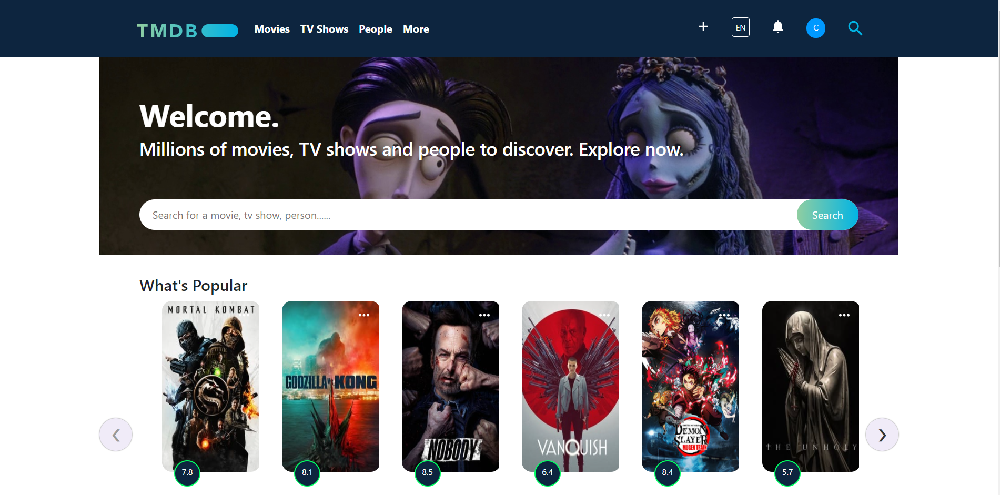
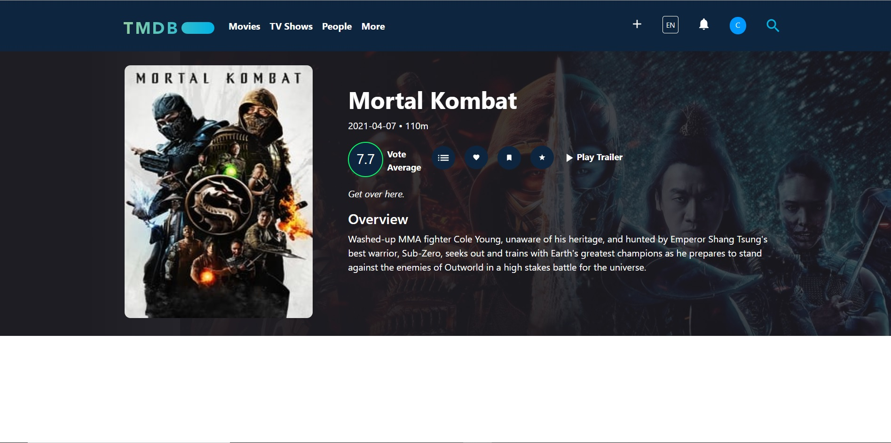
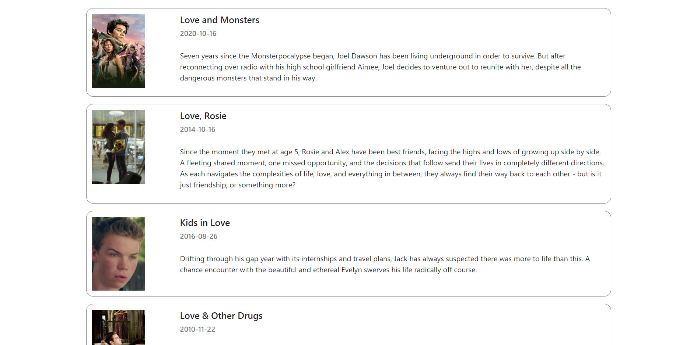

# TMBD Movie 

TMDB is a web page that can help to find not only some popular movies, top-rated movies but also other kinds of movies, tv shows, and detailed information.

## Tools

- This project was generated with React js in the front end part. Data was gotten from TMBD api (https://www.themoviedb.org/documentation/api).  
- Axios was used to access the data.  
- I used SCSS, material UI and bootstrap in the design part.  

## Preparation 

First of all I set up React Js with `npx create-react-app tmbd-react-api` comment. After completed setting up, I started project with the navbar part and then I add routes in App.js. 
I created a folder called Home and created related components inside the Home folder because of the fact that my focus point was the only Home page.
 
When I went to Home file. I had to install Axios (`npm i axios`) for getting TMBD Api. I used two times Axios because I needed the accessing popular and top rated movies data. 
 
In the Home file, I added the SearchBar component and MovieList component for showing them on the main page.
Moreover, while search movie, tv show or person, you will see the list in home page.
 
I wanted to show a movie list with a slider and after some research, I learned that I need to use Carousels in the Bootstrap for react js. 
 
In the MovieDetail file, I had to use Axios for accessing the API that shows the detailed information of movies. When you follow the TMDB API web page, you can see details. `(https://developers.themoviedb.org/3/movies/get-movie-details)`. Finally thanks to `const { id } = props.match.params` ,when you click on the picture of any movie, you can see the detailed information of that movie. 

## After cloning my code...

After you clone or take this code to your local, firstly you should install npm in the terminal with an `npm install` statement. Later, when you write `npm start` comment in the terminal, this code will open in your browser with `(http://localhost:3000/)`. 🎉

## Resources

- When creating projects with react, the most essential website is rect's own site for me. (https://reactjs.org/).  
- React Bootstrap: (https://react-bootstrap.github.io/) , for slider: (https://react-bootstrap.github.io/components/carousel/) (`npm i react-elastic-carousel`)  
- Material UI for icons : (https://material-ui.com/components/material-icons/)  
- For setting axios : (https://www.npmjs.com/package/axios)  
- TMDB API : (https://developers.themoviedb.org/3/movies/get-popular-movies)  
- And of course, I shouldn't forget Stackoverflow 😃.

